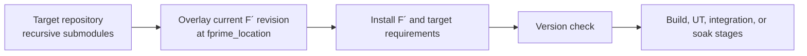

# How F´ CI works

This page describes the checks in this directory and the shared actions used
to run them. The commands below reproduce the important checks without
starting a GitHub Actions run.

## Workflow map

| Workflow | Verifies | Runs | Main logic |
| --- | --- | --- | --- |
| `framework.yml` | Framework build, UTs, TSan, clang-tidy | PR, nightly, release | `fprime-actions` |
| `ref.yml` | Ref build, integration tests, UTs | PR, nightly, release | `fprime-actions` |
| `fpp-tests.yml` | FppTest UTs, including direct port calls | PR, nightly, release | in-repo + `fprime-actions` |
| `fpp-to-json.yml` | Ref FPP-to-JSON generation | PR, nightly, release | in-repo |
| `config-test.yml`, `config-test-nightly.yml` | Framework and Ref configuration profiles | PR, nightly, dispatch | `ci/config-profiles.json` + `fprime-actions` |
| `format-check.yml`, `python-format.yml` | C++ and Python formatting | PR, nightly, release | in-repo |
| `markdown-link-check.yml` | Markdown links and generated docs | PR, nightly, docs branch | in-repo + third-party action |
| `cmake-test.yml`, `pip-check.yml` | CMake tests and requirements installation | PR, nightly, release or requirements changes | in-repo |
| `build-test-rhel8.yml` | RHEL 8 framework, Ref, and UT builds | PR, nightly, release | in-repo |
| `cppcheck-scan.yml` | CppCheck static analysis | PR, nightly, release | in-repo |
| `codeql-jpl-standard.yml`, `codeql-security-scan.yml` | CodeQL scans | PR, push, schedule, dispatch | CodeQL + `fprime-actions` |
| `codeql-query-tests.yml` | JPL CodeQL query tests | PR, push, schedule | in-repo |
| `component-checks.yml` | Component metadata checks | PR, push, schedule, dispatch | `fprime-actions` |
| `coverage-check.yml` | PR unit-test coverage against a baseline | PR | `fprime-actions` |
| `coverage-comment.yml` | Posts the coverage artifact as a PR comment | `workflow_run` | `fprime-actions` |
| `coverage-update.yml` | Publishes coverage baselines | nightly, release push, tags | `fprime-actions` |
| `int-coverage-update.yml` | Publishes integration-coverage baselines | schedule, dispatch | `fprime-actions` |
| `cancel-merged-pr-runs.yml` | Cancels runs for merged PRs | workflow event | in-repo |
| `site-regenerate.yml` | Regenerates the documentation site | dispatch | in-repo |
| `ext-build-hello-world.yml`, `ext-build-led-blinker.yml`, `ext-build-math-comp.yml` | Tutorial build and UT checks | PR, nightly, release | `reusable-project-builder.yml` |
| `ext-build-examples-repo.yml` | Examples build and UT checks | PR, nightly, release, dispatch | `reusable-project-builder.yml` |
| `ext-cookiecutters-test.yml` | Cookiecutter project generation and builds | PR, nightly, release | in-repo |
| `ext-build-fprime-python-reference.yml`, `ext-fprime-cfs-reference.yml`, `ext-generic-hub-reference.yml`, `ext-yamcs-reference.yml` | External reference builds and integration tests | PR, nightly, release | `external-repository-setup` + `fprime-actions` |
| `ext-fprime-zephyr-reference.yml` | Zephyr reference cross-compilation | PR, nightly, release | `external-repository-setup` + `fprime-ci` |
| `ext-aarch64-linux-led-blinker.yml`, `ext-raspberry-led-blinker.yml` | Cross-compilation and hardware integration tests | PR, nightly, release | in-repo + `fprime-actions` |
| `ext-aarch64-linux-reference-soak-setup.yml`, `ext-aarch64-linux-reference-soak-test.yml`, `ext-aarch64-linux-reference-soak-summary.yml` | AArch64 soak setup, analysis, and summary | release, schedule, dispatch | `soak-*` actions |
| `ext-pico2-zephyr-reference-soak-setup.yml`, `ext-pico2-zephyr-reference-soak-test.yml`, `ext-pico2-zephyr-reference-soak-summary.yml` | Pico 2 soak setup, analysis, and summary | schedule, dispatch | `reusable-project-ci.yml` + `soak-*` actions |

Most PR workflows ignore documentation-only changes through `paths-ignore`.
Concurrency settings cancel superseded PR runs where the workflow permits it.
The framework and Ref workflows run macOS only on the nightly schedule.

## Anatomy of an external-repository check

External checks build a target repository with the current F´ revision
overlaid on its F´ submodule path. The target checkout uses recursive
submodules first; the overlay checkout then replaces only the path named by
`fprime_location` (or `overlay_location`).



The pinned `lib/fprime` SHA in the target repository is therefore not the
revision that gets built. Other target submodules remain pinned. The overlay's
own `submodules: recursive` checkout supplies `fprime/googletest`.

`fprime_location` is repository-specific: common values are `./lib/fprime`,
`./fprime`, `lib/fprime`, `./libs/fprime`, and
`./FlightExamples/lib/fprime`. The value must match the target repository
layout. `reusable-project-ci.yml` defaults to `./lib/fprime`; 
`reusable-project-builder.yml` defaults to `./fprime`.

## Branch resolution for external repositories

`reusable-get-pr-branch.yml` and `fprime-actions/get-pr-branch@devel` resolve
the target branch in this order:

1. On a pull request, use `pr-<PR number>` if it exists.
2. Use a target branch with the same name as the PR base branch, such as
   `release/vX.Y`.
3. Use `devel` (or the workflow's `default_target_ref`).

Create the `pr-<N>` branch in the target repository before the F´ PR check
starts:

```bash
git -C ../target-repository fetch origin
git -C ../target-repository switch -c pr-<N> origin/devel
git -C ../target-repository push origin pr-<N>
```

## Tool version resolution

External setup applies these layers in order:

1. Install the F´ pins from `fprime/requirements.txt`.
2. Install the target repository's `requirements.txt`, if present. Later
   requirements can replace those pins.
3. On a pull request, `upgrade-package` with `pr-branch-only: true` replaces
   `fprime-gds` with `git+https://github.com/nasa/fprime-gds@pr-<N>` only when
   that branch exists. It does not fall back to `devel`.

The setup then runs `fprime-util version-check --all-submodules`. Use
`-DFPRIME_SKIP_TOOLS_VERSION_CHECK=1` only when intentionally developing a
modified FPP/tool version; the existing [modified FPP
instructions](../../CONTRIBUTING.md#development-with-modified-fpp-version)
cover that case.

There are three setup entry points:

| Entry point | Purpose |
| --- | --- |
| `.github/actions/setup` | Installs one repository's `requirements.txt`; used by local framework workflows. |
| `nasa/fprime-actions/setup@devel` | Adds pip caching and ccache, then installs one F´ repository. |
| `nasa/fprime-actions/external-repository-setup@devel` | Checks out the target, overlays F´, installs target requirements and `fprime-ci`, runs an optional target setup hook, and performs the version check. |

## Shared building blocks

`make-space` frees runner disk space. `ccache` caches C/C++ compilation.
`output-cleaner` reduces repetitive build output. `external-repository-setup`
performs the target checkout and overlay. `upgrade-package` selects a
matching package branch. `timing-check` reports slow jobs. `coverage-*`
collects, checks, comments, and publishes coverage. `soak-*` manages persistent
soak deployments, tests, and summaries. `fprime-ci` reads a target
repository's configuration and runs its configured build or integration stage.

All shared action references use `@devel`, as do the target repositories'
usual `devel` branches and `fprime-community/fprime-ci`. A run can therefore
change without a commit to the F´ PR. Compare the failing step with the
workflow and action revisions, then reproduce against the same target branch
and tool versions before treating an unrelated failure as a regression.

## Reproduce a CI check locally

Run these commands from the indicated directory after installing the
tool suite. Replace `<N>` with a number from 1 through 32 when the workflow
uses `jobs: random`; varying parallelism is intentional.

| Check | Command |
| --- | --- |
| Framework build | `fprime-util generate && fprime-util build --all -j<N>` |
| Framework UTs | `fprime-util generate --ut && fprime-util build --all --ut -j<N> && fprime-util check --all -j<N> --pass-through --output-on-failure` |
| Framework TSan | `fprime-util generate --ut -DENABLE_SANITIZER_THREAD=ON -DENABLE_SANITIZER_ADDRESS=OFF -DENABLE_SANITIZER_LEAK=OFF -DENABLE_SANITIZER_UNDEFINED_BEHAVIOR=OFF -DFPRIME_ENABLE_UT_COVERAGE=OFF && TSAN_OPTIONS='halt_on_error=1 history_size=5 suppressions=$PWD/.github/tsan-suppressions.txt' fprime-util check --all -j<N> --pass-through --output-on-failure --timeout 600` |
| Ref build | `cd TestDeploymentsProject && fprime-util generate && fprime-util build -j<N>` |
| Ref UTs | `cd TestDeploymentsProject && fprime-util generate --ut && fprime-util build --all --ut -j<N> && fprime-util check --all -j<N> --pass-through --output-on-failure` |
| FppTest | `cd FppTestProject && fprime-util generate --ut -DFPRIME_ENABLE_JSON_MODEL_GENERATION=ON && cd FppTest && fprime-util build --ut && fprime-util check --pass-through --output-on-failure` |
| FppTest direct port calls | `cd FppTestProject && fprime-util generate --ut -DFPRIME_ENABLE_DIRECT_PORT_CALLS=ON -DFPRIME_ENABLE_JSON_MODEL_GENERATION=ON && cd FppTest && fprime-util build --ut && fprime-util check --pass-through --output-on-failure` |
| Clang-tidy quality | `fprime-util generate -DCMAKE_C_COMPILER=gcc-10 -DCMAKE_CXX_COMPILER=g++-10 '-DCMAKE_CXX_CLANG_TIDY=clang-tidy-12;--config-file='\"$PWD\"'/release.clang-tidy' && fprime-util build --all` |
| C++ format | `fprime-util format --check --dirs CFDP default Drv FppTestProject Fw Os Ref Svc TestUtils Utils` |
| Python format | `pip install click==8.0.4 black==21.6b0 && black --check --diff ./` |
| Markdown links | `npx --yes markdown-link-check --config ./.github/actions/markdown-check/mlc-config.json <markdown-file>` |
| CMake tests | `cd cmake/test && export CMAKE_INSTALL_DIRECTORY=\"$PWD/../../tools-override\" && export PATH=\"$CMAKE_INSTALL_DIRECTORY/bin:$PATH\" && cmake --version && pytest -s` |
| Configuration profiles | `jq -r '.[] | select(.disabled != true) | [.name, .[\"generate-args\"]] | @tsv' ci/config-profiles.json`; for each row run `fprime-util generate <generate-args> && fprime-util build --all -j<N>`, then run the same `generate` and `build -j<N>` in `TestDeploymentsProject`; run `fprime-util generate --ut` and `build --all --ut`/`check --all` similarly. |
| External repository overlay | `git clone --recurse-submodules <target-url> target && mv target/lib/fprime target/lib/fprime.pinned && ln -s \"$PWD\" target/lib/fprime && (cd target && pip install -r lib/fprime/requirements.txt && fprime-util version-check --all-submodules)`; use the target's actual `fprime_location` when it is not `lib/fprime`. |
| `fprime-ci` integration | From the target repository root, run `fprime-ci -c <config> --add-stage build`, then after obtaining `archive.tar.gz` run `fprime-ci -c <config> --skip-stage build`. |

The active configuration profiles are `no-object-names`,
`direct-port-calls`, `fileid-assert`, `no-assert`, `relative-path-assert`,
`no-port-serialization`, `assertions-always-abort`, and
`no-cmd-residual-check`. The `minimal` and `no-text-logging` profiles are
disabled in `ci/config-profiles.json`.
