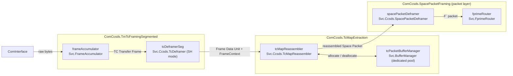

# ComCcsds (CCSDS Framing) Subtopology — Software Design Document (SDD)

The **ComCcsds subtopologies** implement F´’s **CCSDS** communications stack for framing/deframing on the flight side. There are **two variants** in the same module:

1. A variant that **supplies a `Svc::ComStub`** implementation of `Svc.ComInterface` and expects to be wired to a **`Drv::ByteStreamDriverModel`** (TCP/UDP/UART, etc.), and
2. A variant that **expects an external implementation of [`Svc.ComInterface`](https://fprime.jpl.nasa.gov/latest/docs/reference/communication-adapter-interface/)** provided by the deployment.

Both variants provide the standard **router + ComQueue + CCSDS framers/deframers** path and are tuned through **ComCcsdsConfig** instance properties.

> [!IMPORTANT]
> `ComCcsds` provides framing/deframing for CCSDS SpacePackets inside TM/TC data transfer frames.

---

## 1. Requirements

| ID               | Description                                                                                                    | Validation |
| ---------------- | -------------------------------------------------------------------------------------------------------------- | ---------- |
| SVC-COMCCSDS-001 | Provide a **CCSDS framer** to convert COM buffers into CCSDS frames for downlink.                             | Inspection |
| SVC-COMCCSDS-002 | Provide a **CCSDS deframing path** to parse incoming CCSDS frames into COM buffers for uplink.                 | Inspection |
| SVC-COMCCSDS-003 | Provide an F´ **router** to route deframed packets (e.g., commands/files) into the flight software.            | Inspection |
| SVC-COMCCSDS-004 | Provide a **subtopology variant that supplies `Svc::ComStub`** designed to connect to a ByteStream driver.     | Inspection |
| SVC-COMCCSDS-005 | Provide a **subtopology variant that expects an external `Svc::ComInterface`** supplied by the deployment.     | Inspection |
| SVC-COMCCSDS-006 | Support **configurable instance properties** (IDs, queue sizes, stack sizes, priorities, CPU affinities, packet spanning) via `ComCcsdsConfig`. | Inspection |
| SVC-COMCCSDS-007 | Provide **composable layer topologies**: a Space Packet packet layer (`SpacePacketFraming`, `SpacePacket`) and a TM/TC transfer frame layer (`TmTcFraming`), from which the full stack is composed. | Inspection |
| SVC-COMCCSDS-008 | Provide a **segmented uplink variant** (`TmTcFramingSegmented`, `TcMapExtraction`, `FramingSubtopologySegmented`, `SegmentedSubtopology`) that processes the CCSDS TC Segment Header, demultiplexes MAP channels and reassembles Space Packets spanning several TC frames from a **dedicated, bounded** buffer pool, without changing the default topologies. | Inspection, Ref segmented build |

---

## 2. Design & Core Functions

### 2.1 Instance Summary

| Instance name         | Type (Svc/Drv)                  | Kind    | Purpose (core function)                                                                         |
| --------------------- | ------------------------------- | ------- | ----------------------------------------------------------------------------------------------- |
| `fprimeRouter`        | `Svc.FprimeRouter` (default; configurable via `ComCcsdsRouterConfig.fpp`) | Passive | Routes deframed packets (e.g., commands/files) into the flight software.                        |
| `comQueue`            | `Svc.ComQueue`                  | Active  | Queues categorized COM data for framing (telemetry, events, file, etc.); exposes `run`.         |
| `spacePacketFramer`   | `Svc.Ccsds.SpacePacketFramer`   | Passive | Builds **CCSDS Space Packets** from COM buffers (downlink step 1).                              |
| `framer`              | `Svc.Ccsds.TmFramer`            | Passive | Builds **CCSDS TM Transfer Frames** from space packets and sends to the link (downlink step 2). |
| `spacePacketDeframer` | `Svc.Ccsds.SpacePacketDeframer` | Passive | Deframes F Prime data from **CCSDS Space Packets** (uplink step 2).                             |
| `tcDeframer`          | `Svc.Ccsds.tcFramer`            | Passive | Deframes **CCSDS Space Packets** from  **CCSDS TM Transfer Frames** (uplink step 1).            |
| `frameAccumulator`    | `Svc.FrameAccumulator`          | Passive | Collects bytes from the link and emits complete frames/packets for deframing (uplink path).     |
| `comStub`             | `Svc.ComStub`                   | Passive | (Variant A only) Implementation of `Svc.ComInterface`, adapting a `Drv::ByteStreamDriverModel`. |
| `tcDeframerSeg`       | `Svc.Ccsds.TcDeframer` (base id `BASE_ID + 0x0B000`) | Passive | (Segmented variants only) `tcDeframer` in **Segment Header mode** (`configureSegmentHeader(true)` in `configComponents`): strips the 1-octet Segment Header into `FrameContext` and drops Type-BC frames. |
| `tcPacketBufferManager` | `Svc.BufferManager` (base id `BASE_ID + 0x0C000`) | Passive | (Segmented variants only) **Dedicated** reassembly pool used exclusively by `tcMapReassembler`: one bin of `TcMapCfg::PoolBufferCount` × `TcMapCfg::MaxPacketSize` octets, manager id `TcMapCfg::PoolManagerId`. |
| `tcMapReassembler`    | `Svc.Ccsds.TcMapReassembler` (base id `BASE_ID + 0x0D000`; defined in `ComCcsdsTcMapConfig.fpp`) | Passive | (Segmented variants only) MAP demultiplexing and Space Packet reassembly from Frame Data Units (uplink step 1b). |

> **Two variants:**
> **A. “With ComStub”:** Subtopology **includes** `Svc::ComStub` and exposes **ByteStream** ports to your driver.
> **B. “With External ComInterface”:** Subtopology **does not include** `Svc::ComStub`; you **provide** one in the deployment.

### 2.1.1 Layered Topologies

The module also exposes the two layers of the stack as importable topologies, allowing projects to compose
alternative stacks (e.g., inserting an SDLS security layer between them) while reusing the same instances:

| Topology             | Contents                                                                                          |
| -------------------- | ------------------------------------------------------------------------------------------------- |
| `SpacePacketFraming` | Packet layer: `comQueue`, `fprimeRouter`, `spacePacketFramer`, `spacePacketDeframer`, `apidManager`, `aggregator`, `commsBufferManager`. Open framing boundary. |
| `SpacePacket`        | `SpacePacketFraming` plus `comStub` — a space-packet-only stack with no transfer frame layer.      |
| `TmTcFraming`       | Transfer frame layer: `framer` (TM), `tcDeframer`, `frameAccumulator`. Open upstream/downstream boundaries. |
| `FramingSubtopology` | `SpacePacketFraming` composed with `TmTcFraming` (variant B).                                      |
| `Subtopology`        | `FramingSubtopology` plus `comStub` (variant A).                                                    |
| `TmTcFramingSegmented` | Transfer frame layer with the TC deframer in Segment Header mode: `framer` (TM), `tcDeframerSeg`, `frameAccumulator`. Same ports as `TmTcFraming`; `dataOut` carries the Frame Data Unit (Segment Header stripped into `FrameContext`). |
| `TcMapExtraction`    | MAP packet extraction layer: `tcMapReassembler`, `tcPacketBufferManager`. Ports `dataIn`/`dataReturnOut` (from the frame layer or an SDLS layer), `dataOut`/`dataReturnIn` (to the packet layer), `poolSchedIn`. |
| `FramingSubtopologySegmented` | `SpacePacketFraming` + `TcMapExtraction` + `TmTcFramingSegmented` (variant C, external `Svc.ComInterface`). |
| `SegmentedSubtopology` | `FramingSubtopologySegmented` plus `comStub` (variant C with `Svc::ComStub`).                        |

The segmented topologies are **additive**: they define new instances only (`tcDeframerSeg`,
`tcPacketBufferManager`, `tcMapReassembler`) and reuse the others. The default topologies, the default
`tcDeframer` (Segment Header mode off) and the generated code of a default deployment are unchanged when the
segmented topologies are not imported. Exactly **one** of `Subtopology`/`FramingSubtopology` and
`SegmentedSubtopology`/`FramingSubtopologySegmented` may be imported by a deployment (they share the packet
layer instances); the switch is the import, there is no runtime mode.

Each layer topology exposes its open boundary as **topology ports** (e.g. `SpacePacketFraming.dataOut`,
`TmTcFraming.framedDataIn`, `FramingSubtopology.comStatusIn`), so composing topologies and deployments wire
to the layer's ports rather than to individual component instances.

### 2.2 Data Flow - Uplink

On uplink, raw bytes from the com interface are accumulated into TC Transfer Frames,
deframed into Space Packets, and routed into the flight software.

```mermaid
flowchart LR
    subgraph TMTC["ComCcsds.TmTcFraming (transfer frame layer)"]
        frameAccumulator["frameAccumulator<br>Svc.FrameAccumulator"]
        tcDeframer["tcDeframer<br>Svc.Ccsds.TcDeframer"]
    end

    subgraph SPF["ComCcsds.SpacePacketFraming (packet layer)"]
        spacePacketDeframer["spacePacketDeframer<br>Svc.Ccsds.SpacePacketDeframer"]
        fprimeRouter["fprimeRouter<br>Svc.FprimeRouter"]
    end

    com["ComInterface<br>comStub (variant A) or external (variant B)"]
    fsw["Flight software<br>(command dispatch, file uplink, ...)"]

    com -->|raw bytes| frameAccumulator
    frameAccumulator -->|TC Transfer Frame| tcDeframer
    tcDeframer -->|Space Packet| spacePacketDeframer
    spacePacketDeframer -->|F´ packet| fprimeRouter
    fprimeRouter -->|commands / files| fsw
```



#### Segmented uplink (variant C)

In the segmented variants each TC Transfer Frame carries a 1-octet **Segment Header**
(CCSDS 232.0-B-4 4.1.3.2.2: bits 7-6 Sequence Flags `01` FIRST / `00` CONTINUING / `10` LAST /
`11` UNSEGMENTED, bits 5-0 MAP ID). `tcDeframerSeg` strips it into `FrameContext`
(`tcSegmentHeaderPresent`, `tcSegmentHeader`) and `tcMapReassembler` reassembles one Space Packet per MAP
from the Frame Data Units (no blocking: exactly one Space Packet per Frame Data Unit sequence).



Every frame buffer is returned upstream synchronously (copy-always): `tcMapReassembler` copies the User
Data portion into a pool buffer and returns the frame on `dataReturnOut`; the completed packet is handed to
`spacePacketDeframer` in the pool buffer and released to `tcPacketBufferManager` when it comes back on
`dataReturnIn`. See the [TcMapReassembler SDD](../../../Ccsds/TcMapReassembler/docs/sdd.md) for the
state machine, every error path and the held-buffer behaviour.

### 2.3 Data Flow - Downlink

On downlink, COM data is queued, framed into CCSDS Space Packets, aggregated, and framed
into TM Transfer Frames for transmission by the com interface.

```mermaid
flowchart LR
    subgraph SPF["ComCcsds.SpacePacketFraming (packet layer)"]
        comQueue["comQueue<br>Svc.ComQueue"]
        spacePacketFramer["spacePacketFramer<br>Svc.Ccsds.SpacePacketFramer"]
        aggregator["aggregator<br>Svc.ComAggregator"]
    end

    subgraph TMTC["ComCcsds.TmTcFraming (transfer frame layer)"]
        framer["framer<br>Svc.Ccsds.TmFramer"]
    end

    com["ComInterface<br>comStub (variant A) or external (variant B)"]
    src["Packet sources<br>(telemetry, events, file downlink)"]

    src -->|COM data| comQueue
    comQueue -->|Fw::Buffer| spacePacketFramer
    spacePacketFramer -->|Space Packet| aggregator
    aggregator -->|aggregated Space Packets| framer
    framer -->|TM Transfer Frame| com
```



For the variant of these flows with an SDLS security layer inserted between the packet and
transfer frame layers, see the [ComCcsdsSdls subtopology](../../ComCcsdsSdls/docs/sdd.md).

### 2.4 Required Inputs for Operation

* **Rate Groups:** Connect a rate group to **`comQueue.run`**. This is not required for the subtopology to function, but defines the rate at which ComQueue will send telemetry.
* **Transport Endpoint:**

  * **Variant A:** Wire **ByteStream send/recv** between your **`Drv::ByteStreamDriverModel`** and the subtopology’s **`ComStub`**.
  * **Variant B:** Provide your own **`Svc::ComInterface`** and wire it to the **CCSDS framer/deframer ports** in the subtopology.
* **Flight-side hookups:** Wire the **router** outputs (commands/files) into your CDH stack (e.g., command dispatcher, file uplink), and feed **packet sources** (telemetry/events/file downlink) into **`comQueue`**.

### 2.5 Limitations

These subtopologies focus on the **CCSDS framing and deframing setup** and does not provide wider CDH.

Segmented variants (see the TcMapReassembler and TcDeframer SDDs for the full list):

* **No blocking** — one Space Packet per Frame Data Unit sequence; a Frame Data Unit carrying more than
  one packet, or fill, is rejected by the exact-length check (`LengthMismatch`).
* **Type-BC (control) frames are dropped** in Segment Header mode (`tcDeframerSeg.ControlFrameDropped`);
  there is no FARM-1/COP-1, so Unlock/SetV(R) are not processed.
* **(VCID, MAP ID) pairs** — only the pairs passed to `TcMapReassembler::configure()` are accepted
  (default: VCID 1, MAP 0); segments for any other pair are discarded (`InvalidMapId`). The same MAP ID on
  two Virtual Channels is two independent reassembly channels.
* **Largest packet** — `TcMapCfg::MaxPacketSize` (4096 octets by default); a larger packet is rejected
  loudly at its first segment (`PacketTooLarge`).
* **No stall timeout** — a partial packet whose remaining segments never arrive holds one pool buffer until
  the next FIRST/UNSEGMENTED on that MAP, a LAST (length mismatch) or an overflow.

---

## 3. Usage

Below are **two usage patterns**, one for each variant. Replace identifiers/ports with the **exact names in `ComCcsds.fpp`**.

### 3.1 Variant A — ComCcsds **with** `Svc::ComStub` (expects a ByteStream driver)

```fpp
topology Flight {
  instance ComCcsds.Subtopology

instance comDriver: <ByteStreamDriverInterface>

# (A1) Schedule ComQueue telemetry downlink (optional)
  connections RateGroups {
    rg.RateGroupMemberOut[0] -> ComCcsds.Subtopology.comQueueRun
  }

  # (A2) Wire ByteStream driver <-> ComStub supplied by the subtopology
  connections Link {
    comDriver.$recv                                -> ComCcsds.Subtopology.drvReceiveIn
    ComCcsds.Subtopology.drvReceiveReturnOut       -> comDriver.recvReturnIn
    ComCcsds.Subtopology.drvSendOut                -> comDriver.$send
    comDriver.ready                                -> ComCcsds.Subtopology.drvConnected
  }
}
```

> [!TIP]
> `ComCcsds.commsBufferManager` and `ComCcsds.commsBufferSendIn` can be used if the `ByteStreamDriver` requires buffer management.

### 3.2 Variant B — ComCcsds **without** `Svc::ComStub`

```fpp
topology Flight {
  import ComCcsds.FramingSubtopology

  # (B1) Provide your own ComInterface
  instance radio: <YourComInterface>

  # (B2) Schedule ComQueue
  connections RateGroups {
    rg.RateGroupMemberOut[0] -> ComCcsds.comQueue.run
  }

  # (B3) Wire your ComInterface between the driver and the ComCcsds framer/deframer
  connections Link {
    # Downlink: framing layer -> your ComInterface
    ComCcsds.FramingSubtopology.dataOut       -> radio.dataIn
    radio.dataReturnOut                       -> ComCcsds.FramingSubtopology.dataReturnIn
    radio.comStatusOut                        -> ComCcsds.FramingSubtopology.comStatusIn

    # Uplink: your ComInterface -> framing layer
    radio.dataOut                             -> ComCcsds.FramingSubtopology.dataIn
    ComCcsds.FramingSubtopology.dataReturnOut -> radio.dataReturnIn
  }
}
```

### 3.3 Variant C — Segmented uplink (Segment Header / MAP reassembly)

Import the segmented topology **instead of** `Subtopology`/`FramingSubtopology`, wire the com interface and
rate groups exactly as in variant A/B, and additionally schedule the dedicated pool's `schedIn`:

```fpp
topology Flight {
  import ComCcsds.SegmentedSubtopology      # or ComCcsds.FramingSubtopologySegmented (variant B style)

  connections RateGroups {
    rg.RateGroupMemberOut[0] -> ComCcsds.comQueue.run
    rg.RateGroupMemberOut[1] -> ComCcsds.SegmentedSubtopology.tcPacketBufferManagerSchedIn
    # with FramingSubtopologySegmented use: ComCcsds.TcMapExtraction.poolSchedIn
  }

  # Link wiring: identical to variant A (SegmentedSubtopology) or variant B (FramingSubtopologySegmented)
}
```

The secured version of this variant (SDLS between the frame layer and the MAP extraction layer) is
`ComCcsdsSdls.SegmentedSubtopology`, see the [ComCcsdsSdls SDD](../../ComCcsdsSdls/docs/sdd.md).

---

## 4. Configuration

> Configure **only the instance properties** owned by the ComCcsds subtopologies. All knobs live under:
> `Svc/Subtopologies/ComCcsds/ComCcsdsConfig/ComCcsdsConfig.fpp`

### 4.1 Component properties (`ComCcsdsConfig.fpp`)

* **Base ID** — Base identifier for the subtopologies; instance IDs are offset from this base.
* **Queue sizes** — Depths for **`ComQueue`** and any other active/queued elements defined by the subtopology.
* **Stack sizes** — Task stack allocations for active components (if any beyond `ComQueue`).
* **Priorities** — RTOS priorities for active/queued components as applicable.
* **CPU affinities** — Core pinning for active component tasks; defaults to `TASK_DEFAULT` (no pinning).
* **Aggregator** — `Aggregator.enablePacketSpanning` controls whether the `aggregator` instance spans CCSDS TM packets across transfer frames (see `Svc.ComAggregator`); `false` by default. `ComCfg::AggregationSize` is the full TM data field, while non-spanning aggregates are limited to `ComCfg::AggregationSize - 7` so the framer can add an idle packet. Any layer inserted between `aggregator` and `framer` that adds bytes (e.g. `ComCcsdsSdls`, +2-byte SA index) requires the project to reduce `ComCfg::AggregationSize` by that overhead.

### 4.2 Buffer Manager Bin Configuration

`module BuffMgr` provides constants for the bins configured for `commsBufferManager`.

### 4.3 Segmented variant: `TcMapCfg` and the dedicated reassembly pool

The segmented variants are configured by two files, both overridable through `register_fprime_config(CONFIGURATION_OVERRIDES ...)`:

* `Svc/Ccsds/TcMapReassembler/config/TcMapReassemblerConfig/TcMapCfg.fpp` — `module TcMapCfg`:

  | Constant            | Default | Meaning                                                                      |
  | ------------------- | ------- | ---------------------------------------------------------------------------- |
  | `MapChannelCount`   | 1       | MAP channels tracked (one reassembly slot each), 1..64                       |
  | `MaxPacketSize`     | 4096    | Largest reassembled Space Packet, 7..65542                                   |
  | `MaxPacketsInFlight`| 4       | Completed packets outstanding downstream (delivered, not yet returned)       |
  | `PoolBufferCount`   | `MapChannelCount + MaxPacketsInFlight` (5) | Buffers in the dedicated pool         |
  | `PoolBytes`         | `PoolBufferCount * MaxPacketSize` (20 480) | Backing memory of the dedicated pool  |
  | `PoolManagerId`     | 201     | `Svc.BufferManager` manager id of the pool (the comms pool is 200)           |

* `Svc/Subtopologies/ComCcsds/ComCcsdsConfig/ComCcsdsTcMapConfig.fpp` — defines `instance tcMapReassembler`
  and its `configComponents` phase, which passes the accepted **(VCID, MAP ID) table** to
  `TcMapReassembler::configure(channels, TcMapCfg::MapChannelCount)`. The default table is `{{1, 0}}`; a
  project overrides this file to accept other pairs (the table must hold exactly `MapChannelCount` distinct
  pairs, every VCID and MAP ID in `0..63`).

**Pool arithmetic.** `tcPacketBufferManager` is set up in `configComponents` with a single bin
`bufferSize = TcMapCfg::MaxPacketSize`, `numBuffers = TcMapCfg::PoolBufferCount`, carved from
`ComCcsds::Allocation::memAllocator` at initialization (no post-init allocation). One buffer per MAP may be
held by an in-progress packet and `MaxPacketsInFlight` completed packets may be outstanding downstream; the
next FIRST/UNSEGMENTED beyond that fails allocation deterministically (`AllocationFailed`, MAP state
unchanged). The instance's `configObjects` phase binds the FPP constants to named `constexpr` values and
`static_assert`s that `PoolManagerId != BuffMgr.commsBuffMgrId`, `PoolBufferCount == MapChannelCount +
MaxPacketsInFlight` and `PoolBytes == PoolBufferCount * MaxPacketSize`.

| Configuration                                                    | `PoolBufferCount` | `PoolBytes`   |
| ---------------------------------------------------------------- | ----------------- | ------------- |
| Default (`MapChannelCount=1, MaxPacketSize=4096, MaxPacketsInFlight=4`) | 5          | 20 480 octets |
| Largest Space Packet, one MAP (`MaxPacketSize=65542`)             | 5                 | 327 710 octets |
| Largest Space Packet, file uplink sized (`MaxPacketsInFlight=10`) | 11                | 720 962 octets |

Projects routing **file uplink** through a segmented MAP must set
`MaxPacketsInFlight >= FileHandlingConfig.QueueSizes.fileUplink` (10 by default) so that a burst of queued
file packets cannot exhaust the pool. The pool is separate from `commsBufferManager` on purpose:
`Svc.BufferManager` allocates first-fit across all its bins, so a reassembly bin inside the comms manager
could be consumed by comms traffic (and vice versa); a dedicated instance is the only isolation the
component offers.

---

## 5. Traceability Matrix

| Requirement ID   | Satisfied by (instance/type)                                                           |
| ---------------- | -------------------------------------------------------------------------------------- |
| SVC-COMCCSDS-001 | `spacePacketFramer` — `Svc.Ccsds.SpacePacketFramer`, `tmFramer` — `Svc.Ccsds.TmFramer` |
| SVC-COMCCSDS-002 | `frameAccumulator` — `Svc.FrameAccumulator`                                            |
| SVC-COMCCSDS-003 | `fprimeRouter` — `Svc.FprimeRouter` (default; swappable via `ComCcsdsRouterConfig.fpp`)      |
| SVC-COMCCSDS-004 | `Subtopology` (variant including `Svc.ComStub`)                                        |
| SVC-COMCCSDS-005 | `FramingSubtopology` (variant expecting external `Svc.ComInterface`)                   |
| SVC-COMCCSDS-006 | `ComCcsdsConfig` module                                                                |
| SVC-COMCCSDS-007 | `SpacePacketFraming`, `SpacePacket`, and `TmTcFraming` topologies                     |
| SVC-COMCCSDS-008 | `TmTcFramingSegmented`, `TcMapExtraction`, `FramingSubtopologySegmented`, `SegmentedSubtopology`; `tcDeframerSeg` — `Svc.Ccsds.TcDeframer`, `tcMapReassembler` — `Svc.Ccsds.TcMapReassembler`, `tcPacketBufferManager` — `Svc.BufferManager` |
