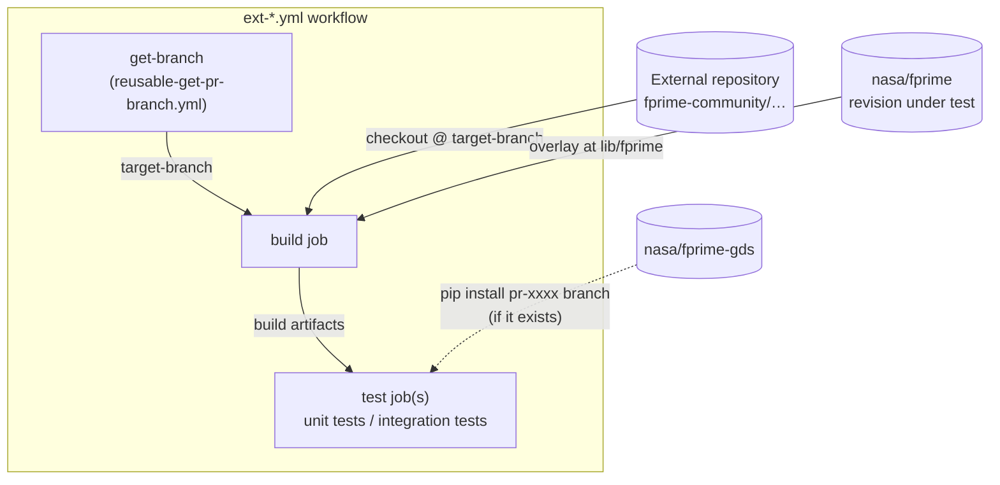
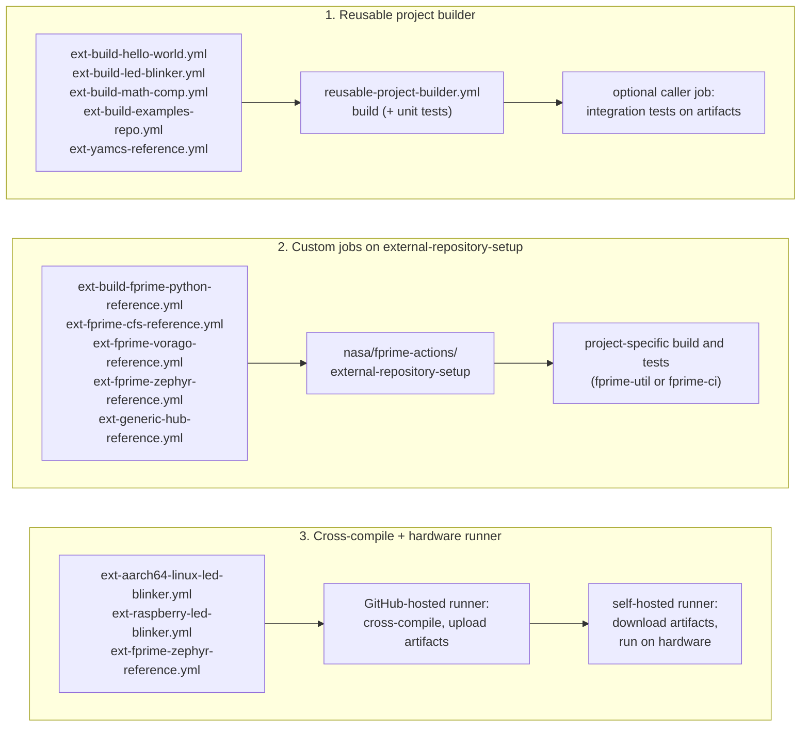
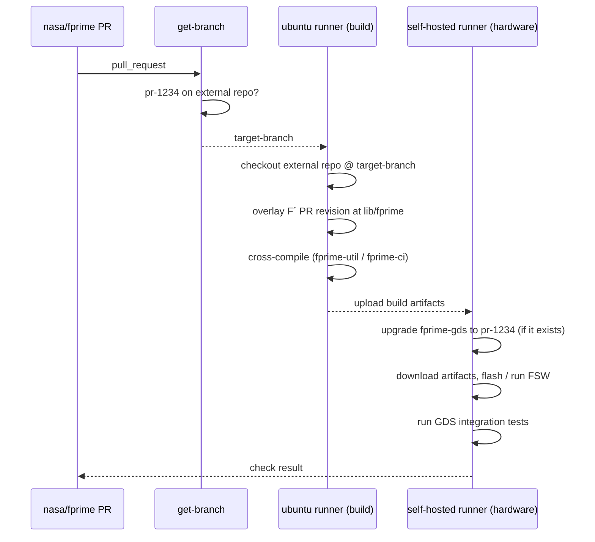
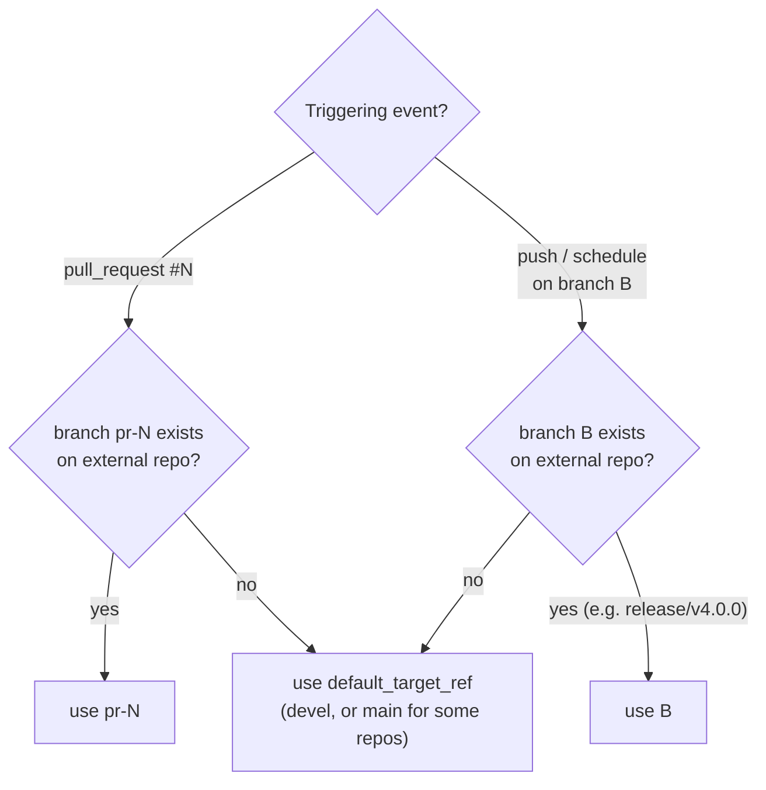

# Continuous Integration

This page describes what F´ runs in continuous integration (CI), how the workflows are organized, and how
changes to F´ are validated against the external projects that depend on it.

All CI runs on GitHub Actions. The workflow definitions live in
[`.github/workflows/`](https://github.com/nasa/fprime/tree/devel/.github/workflows) in the `nasa/fprime` repository.
Most of the individual steps (tool setup, build, unit tests, integration tests, coverage, timing checks, etc.) are
implemented as composite actions in [`nasa/fprime-actions`](https://github.com/nasa/fprime-actions) and are consumed
with `uses: nasa/fprime-actions/<action>@devel`. Each action has a `README.md` documenting its inputs.

> [!NOTE]
> This page documents the CI of the F´ framework repository itself. Projects built on F´ typically use
> [`fprime-ci`](https://github.com/fprime-community/fprime-ci) and the actions in `nasa/fprime-actions` to set up their
> own CI; the patterns described under [External repository checks](#external-repository-checks) are a good starting
> point.

## Common conventions

Unless noted otherwise in the sections below, every workflow follows the same conventions.

**Triggers**

| Event | When | Purpose |
| --- | --- | --- |
| `pull_request` | PRs targeting `devel` or `release/**` | Gate every change before merge. |
| `push` | Pushes to `release/**` | Validate release branches (there is no `push` trigger on `devel`, see below). |
| `schedule` | Nightly at 21:00 UTC (2:00 PM US/Pacific) | Full run on `devel`, including the configurations that are too expensive for PRs (e.g. macOS runners, the full config matrix). |
| `workflow_dispatch` | Manual | Selected workflows expose inputs such as the runner or the `-j` job count for debugging. |

Because `devel` is only updated by merging pull requests that already passed CI, most workflows do not re-run on
`push` to `devel`; the nightly `schedule` run acts as the run-of-record on `devel`. Workflows that publish data
(coverage, component checks, CodeQL findings) run on `push` to `release/**`, on tags, and on the nightly schedule.

**Path filters.** Source-oriented workflows use `paths-ignore` so that pull requests touching only documentation
(`docs/**`, `**.md`, issue templates, agent instructions, spelling action) do not trigger builds.

**Concurrency.** Workflows use the concurrency group `<workflow>-<PR number | ref>` and cancel superseded runs on
pull requests only (`cancel-in-progress` is disabled for `devel` and `release/**`), so pushing a new commit to a PR
cancels the still-running checks of the previous commit.

**Permissions.** Workflows request the minimum permissions they need, typically `contents: read`. Workflows that need
write access (posting a comment, pushing to a baseline branch) are structured so that no pull request code runs with
those permissions (see [Coverage and quality baselines](#coverage-and-quality-baselines)).

**Timing checks.** `Framework` and `Ref` end with a `timing-check` job (`nasa/fprime-actions/timing-check`). It
compares the duration of each job against a baseline built from recent successful runs on `devel` and annotates the run
when a job became significantly slower. It is currently warn-only.

## Types of CI

### Framework build and test

These workflows build and test the framework itself, with the in-repo `Ref` deployment as the main integration
vehicle.

| Workflow | File | What it does |
| --- | --- | --- |
| Framework | `framework.yml` | Builds the framework, runs all unit tests (`fprime-util check`), runs the ThreadSanitizer suite, runs the `clang-tidy`-based quality build, then the timing check. macOS runners are included on the nightly run only. |
| Ref | `ref.yml` | Builds the `Ref` deployment (in `TestDeploymentsProject`), uploads the build artifacts, then runs the GDS integration tests (`Ref/test/int`) against the downloaded binary under `valgrind` on Linux. Also runs the `Ref` unit tests. |
| Config Test | `config-test.yml` | Builds the framework and `Ref` and runs the unit tests under the `minimal` configuration profile from [`ci/config-profiles.json`](https://github.com/nasa/fprime/blob/devel/ci/config-profiles.json). The jobs are skipped when that profile is marked `disabled`. |
| Config Test Nightly | `config-test-nightly.yml` | Nightly (10:00 UTC) run of every enabled profile in `ci/config-profiles.json` (alternate configuration settings such as no asserts, no object names, direct port calls, no port serialization, ...). |
| CI [RHEL8] | `build-test-rhel8.yml` | Builds the framework, `Ref`, and the unit tests inside a `redhat/ubi8` container to validate the oldest supported toolchain. |
| CMake Test | `cmake-test.yml` | Runs the build-system tests in `cmake/test` with `pytest`. |
| FppTest | `fpp-tests.yml` | Builds and runs the FPP autocoder test project (`FppTest`), in both the default and direct-port-call configurations. |
| fpp-to-json Test | `fpp-to-json.yml` | Generates `Ref` and runs `fpp-to-json` on its topology to check the FPP model can be exported. |

### Code quality and static analysis

| Workflow | File | What it does |
| --- | --- | --- |
| Code Format Check | `format-check.yml` | `fprime-util format --check` (clang-format) on C++ sources. |
| Format Python | `python-format.yml` | `black --check` on Python sources. |
| Code Scan: CppCheck | `cppcheck-scan.yml` | Builds with `compile_commands.json`, runs Cppcheck, uploads SARIF and a Markdown summary, fails on reported errors. |
| Code Scan: CodeQL Security | `codeql-security-scan.yml` | CodeQL security queries for C++ and Python. |
| Code Scan: JPL Coding Standard | `codeql-jpl-standard.yml` | CodeQL matrix over the JPL C++ coding-standard query packs. |
| Code Scan: JPL Coding Standard Query Tests | `codeql-query-tests.yml` | Unit tests for the custom CodeQL queries that refine the JPL standard packs. |
| Check Markdown links | `markdown-link-check.yml` | Generates the Doxygen and CMake API docs, then checks links in all Markdown files. |
| Python Dependency Check | `pip-check.yml` | Installs `requirements.txt` on Python 3.10 through 3.14 across Ubuntu and Intel/ARM macOS runners. |

CodeQL analysis runs on every pull request so regressions fail the check, but alerts are only uploaded to the GitHub
code-scanning UI from runs on the default branch (`devel`) to avoid stale branches accumulating alerts.

### Coverage and quality baselines

Several workflows maintain per-branch *baseline branches* named `coverage/<ref-name>` (for example `coverage/devel`,
`coverage/release/v4.2.0`, `coverage/v4.2.0`). These orphan branches store unit-test coverage, integration-test
coverage, component checklist results, and CodeQL findings for every module, and back the coverage badges and reports
published on the website.

| Workflow | File | Trigger | What it does |
| --- | --- | --- | --- |
| Coverage Update | `coverage-update.yml` | `push` to `release/**`, tags, nightly, manual | Generates per-module and global `gcovr` unit-test coverage and pushes it to `coverage/<ref-name>`. |
| Integration Coverage Update | `int-coverage-update.yml` | Nightly (22:00 UTC), manual | Builds an instrumented `Ref`, runs the integration-test suite, splits system-wide coverage per module, and publishes it to `coverage/<ref-name>`. |
| Component Checks | `component-checks.yml` | `push` to `release/**`, tags, nightly, manual | Runs the component checklist gate scripts (requirements, design, implementation, unit-test checks) per module and publishes the results. |
| Coverage Check | `coverage-check.yml` | `pull_request` | Generates coverage for the PR and compares it against the matching `coverage/<base-ref>` baseline. Runs with `contents: read` and uploads the comparison as an artifact. |
| Coverage Comment | `coverage-comment.yml` | `workflow_run` of Coverage Check | Downloads the artifact and posts or updates the coverage comment on the PR. |
| Site Regenerate | `site-regenerate.yml` | Manual | Fans out `workflow_dispatch` calls to the coverage, integration coverage, component checks, and CodeQL publishers for a chosen ref, to rebuild a baseline branch from scratch. |

The Coverage Check / Coverage Comment split exists because `pull_request` workflows triggered from forks never get
write permissions: the read-only workflow computes the result, and the privileged `workflow_run` workflow posts it
without checking out or executing any pull request code.

### External repositories

The `ext-*.yml` workflows build and test projects that live *outside* `nasa/fprime` (tutorials, reference
applications, tooling) against the F´ revision under test. They are described in detail in
[External repository checks](#external-repository-checks) below.

### Soak tests on hardware

The `ext-*-soak-*.yml` workflows deploy a reference application on hardware attached to a self-hosted runner and keep
it running for extended periods. They are described in [Soak tests](#soak-tests) below.

### Housekeeping

| Workflow | File | What it does |
| --- | --- | --- |
| Cancel Merged PR Runs | `cancel-merged-pr-runs.yml` | When a PR is closed or merged, cancels its queued and in-progress runs to free runners. Uses `pull_request_target` but only calls the Actions API; it never checks out or executes PR code. |

### Reusable workflows

The `reusable-*.yml` files have no triggers of their own (`on: workflow_call`) and are called from other workflows
with `uses: ./.github/workflows/<file>`.

| File | Purpose |
| --- | --- |
| `reusable-get-pr-branch.yml` | Resolves which branch of an external repository to test against (see [The `pr-xxxx` process](#the-pr-xxxx-process)). Thin wrapper around `nasa/fprime-actions/get-pr-branch`. |
| `reusable-project-builder.yml` | Checks out an external project, overlays the current F´ revision, builds it, optionally builds and runs its unit tests, and uploads build artifacts and test logs. |
| `reusable-project-ci.yml` | Same setup, but drives the build and integration stages through a project-provided `fprime-ci` configuration file. |

## External repository checks

### Why

F´ is consumed by many projects that pin it as a git submodule: the tutorials
([HelloWorld](https://github.com/fprime-community/fprime-tutorial-hello-world),
[LedBlinker](https://github.com/fprime-community/fprime-workshop-led-blinker),
[MathComponent](https://github.com/fprime-community/fprime-tutorial-math-component)), the reference applications
under [`fprime-community`](https://github.com/fprime-community), and [`nasa/fprime-examples`](https://github.com/nasa/fprime-examples).
Running their builds and tests against every F´ pull request has two purposes:

1. It exercises far more code paths (cross-compilation, Zephyr, cFS, YAMCS, Python components, hub topologies,
   real hardware) than the in-repo `Ref` deployment.
2. It keeps the tutorials and reference applications from silently going out of date. A change that breaks *how* F´
   is used forces the corresponding fix to be prepared in the external repository at the same time (see
   [The `pr-xxxx` process](#the-pr-xxxx-process)).

### The common pattern

Every `ext-*.yml` workflow (soak workflows aside) is built from the same pieces:



1. **Resolve the branch** of the external repository with `reusable-get-pr-branch.yml`. The job outputs
   `target-branch`, which the following jobs consume.
2. **Check out the external repository** at `target-branch`, with submodules.
3. **Overlay the F´ revision under test** on top of the project's F´ submodule (usually `lib/fprime`, configurable
   through `fprime_location`). The external project is therefore built against the pull request's code rather than the
   commit it pins.
4. **Set up the tools** from the overlaid F´'s `requirements.txt` (plus the project's own `requirements.txt` and
   `overrides.txt` if present), run `fprime-util version-check`, and enable `ccache`.
5. **Build**, and upload the build artifacts.
6. **Test**: run the project's unit tests and/or download the artifacts and run the project's GDS integration tests. On
   pull requests, the test job first upgrades `fprime-gds` to a matching `pr-xxxx` branch if one exists.

Steps 2 to 4 are packaged as `nasa/fprime-actions/external-repository-setup`, which is used both directly in workflows
and inside `reusable-project-ci.yml`. `reusable-project-builder.yml` performs the equivalent steps with
`actions/checkout` and `nasa/fprime-actions/setup`.

### The three flavors

The workflows differ in how much of the pattern is delegated to a reusable workflow.



**1. Reusable project builder.** The workflow is a few lines: a `get-branch` job and a `run` job that calls
`reusable-project-builder.yml` with the repository, its F´ submodule location, and whether to run unit tests.

```yaml
jobs:
  get-branch:
    uses: ./.github/workflows/reusable-get-pr-branch.yml
    with:
      target_repository: fprime-community/fprime-workshop-led-blinker
  run:
    needs: get-branch
    uses: ./.github/workflows/reusable-project-builder.yml
    with:
      target_repository: fprime-community/fprime-workshop-led-blinker
      fprime_location: lib/fprime
      target_ref: ${{ needs.get-branch.outputs.target-branch }}
      run_unit_tests: true
```

`ext-build-examples-repo.yml` and `ext-yamcs-reference.yml` add a job after the builder that downloads the build
artifacts and runs the project's integration tests (with `fprime-gds`, or with YAMCS and Java 17 respectively).

**2. Custom jobs on `external-repository-setup`.** Projects whose build or test steps do not fit the builder write
their own job, starting with `nasa/fprime-actions/external-repository-setup`. Examples:

- `ext-build-fprime-python-reference.yml` builds a deployment with Python components and runs its integration tests
  with `python3` as the flight-software binary.
- `ext-fprime-cfs-reference.yml` builds F´ inside a cFS application and runs integration tests.
- `ext-fprime-vorago-reference.yml` runs inside the `llvm-vorago-arm-toolchain` container and builds a matrix of
  bare-metal toolchains plus a Linux unit-test build.
- `ext-generic-hub-reference.yml` builds two deployments connected through the generic hub pattern, starts both with
  a GDS, and checks that a command round-trips across the hub.
- `ext-fprime-zephyr-reference.yml` builds with `fprime-ci -c <config> --add-stage build` for each board and uploads
  one archive per board.

**3. Cross-compile and run on hardware.** The build job runs on a GitHub-hosted Ubuntu runner and cross-compiles
(AArch64 Linux toolchain, Raspberry Pi toolchain, or Zephyr SDK through `fprime-ci`). The artifacts are then downloaded
by a job on a self-hosted runner with the hardware attached (`[self-hosted, aarch64-linux]`, `[self-hosted, raspberrypi]`,
`apple-ci` for the Zephyr boards), which runs the binary and the GDS integration tests against it.



### Inventory

| Workflow | External repository | Flavor | Runs |
| --- | --- | --- | --- |
| `ext-build-hello-world.yml` | `fprime-community/fprime-tutorial-hello-world` | 1 | Build |
| `ext-build-led-blinker.yml` | `fprime-community/fprime-workshop-led-blinker` | 1 | Build, unit tests |
| `ext-build-math-comp.yml` | `fprime-community/fprime-tutorial-math-component` | 1 | Build, unit tests |
| `ext-build-examples-repo.yml` | `nasa/fprime-examples` | 1 | Build, unit tests, GDS integration tests |
| `ext-yamcs-reference.yml` | `fprime-community/fprime-yamcs-reference` (default `main`) | 1 | Build, integration tests through YAMCS |
| `ext-build-fprime-python-reference.yml` | `fprime-community/fprime-python-reference` (default `main`) | 2 | Build, GDS integration tests |
| `ext-fprime-cfs-reference.yml` | `fprime-community/fprime_cfs_reference` | 2 | Build, GDS integration tests |
| `ext-fprime-vorago-reference.yml` | `fprime-community/fprime-vorago-reference` | 2 | Bare-metal toolchain matrix, unit tests |
| `ext-generic-hub-reference.yml` | `fprime-community/fprime-generic-hub-reference` | 2 | Build, hub command round-trip test |
| `ext-fprime-zephyr-reference.yml` | `fprime-community/fprime-zephyr-reference` | 2 + 3 | `fprime-ci` build for Pico 2 and Teensy 4.1, flash and integration tests on hardware |
| `ext-aarch64-linux-led-blinker.yml` | `fprime-community/fprime-workshop-led-blinker` | 3 | AArch64 Linux cross-compile, integration tests on hardware |
| `ext-raspberry-led-blinker.yml` | `fprime-community/fprime-workshop-led-blinker` | 3 | Raspberry Pi cross-compile, integration tests on hardware |
| `ext-cookiecutters-test.yml` | `nasa/fprime-tools`, `fprime-community/fprime-bootstrap` | — | Bootstraps a new project with `fprime-bootstrap`, creates a deployment and a component from the cookiecutters, builds them |

`ext-cookiecutters-test.yml` is the exception to the pattern: instead of checking out a project, it resolves matching
branches of `fprime-tools` and `fprime-bootstrap`, installs them, and checks that a project created from scratch
builds against the F´ revision under test.

## The `pr-xxxx` process

External repository checks pin nothing: they always test the F´ revision under review against *some* branch of the
external repository, normally its `devel`. When an F´ pull request changes how F´ is used (a CMake API change, a
renamed component, an FPP syntax change, ...), the external project must change too, and its `devel` cannot be
updated before the F´ change lands. The `pr-xxxx` convention solves this ordering problem.

**Rule.** For a pull request number `N` in `nasa/fprime`, if the external repository has a branch named `pr-N`, the
external checks use that branch instead of the default.



The resolution is implemented once in `nasa/fprime-actions/get-pr-branch` (wrapped by `reusable-get-pr-branch.yml`)
and queries the GitHub API for the branch:

1. On `pull_request` events, use `pr-<N>` if it exists on the target repository.
2. Otherwise, if the target repository has a branch with the same name as the current ref (for example a
   `release/v4.0.0` branch pushed to F´ and a tracking `release/v4.0.0` branch on the external repository), use it.
   This only applies to `push` and `schedule` runs, since pull request runs execute on a merge ref.
3. Otherwise, use `default_target_ref` (`devel` unless the workflow overrides it).

The same mechanism is used for the ground system: on pull requests, integration-test jobs run
`nasa/fprime-actions/upgrade-package` with `repository: nasa/fprime-gds` and `pr-branch-only: true`. If
`nasa/fprime-gds` has a `pr-N` branch it is installed with `pip`, otherwise the version pinned by `requirements.txt`
stays installed (there is deliberately no fallback to GDS `devel`). This is how an F´ change that requires a GDS
change (for example a dictionary or protocol change) is tested end to end.

**Workflow for a contributor** whose F´ pull request `#1234` breaks an external check:

1. Fix the external project on a branch named `pr-1234` in that repository (for `fprime-gds`, the fix goes on a
   `pr-1234` branch of `nasa/fprime-gds`). Maintainers can push the branch for contributors who do not have write
   access.
2. Re-run the failing check on the F´ pull request. The `get-branch` job logs which branch it resolved
   (`PR branch found, using pr-1234`).
3. After the F´ pull request merges, a maintainer merges `pr-1234` into the external repository's default branch,
   updates its F´ submodule, and deletes `pr-1234`.

## Soak tests

Soak tests keep a reference deployment running on hardware for days and periodically check it for FATAL events,
resource threshold breaches, slow leaks, and integration-test regressions. Two deployments are soaked:

| Deployment | Workflows | Runner |
| --- | --- | --- |
| AArch64 Linux reference | `ext-aarch64-linux-reference-soak-{setup,test,summary}.yml` | `[self-hosted, ARM64, soak-test]` |
| Pico 2 Zephyr reference | `ext-pico2-zephyr-reference-soak-{setup,test,summary}.yml` | `[self-hosted, soak-test]` |

Each deployment has three workflows that share a concurrency group so they never overlap:

- **Soak Setup** runs on F´ releases (`release` event) or manually. It builds the deployment (cross-compiling on an
  Ubuntu runner, or through `reusable-project-ci.yml` for the Pico 2), installs it on the target, and starts a
  persistent flight software and GDS pair as system services (`nasa/fprime-actions/soak-setup`).
- **Soak Test** runs every two hours on a schedule. It analyzes the telemetry accumulated since the last run and then
  runs the deployment's integration tests against the still-running GDS (`nasa/fprime-actions/soak-test`).
- **Soak Summary** is manual and produces a report from the accumulated soak logs (`nasa/fprime-actions/soak-summary`).

## Debugging CI

- Most workflows upload logs as artifacts (unit-test logs, GDS logs, `fprime-ci` archives), available from the run's
  summary page.
- `Framework`, `Ref`, and `Config Test Nightly` accept `workflow_dispatch` inputs to choose the runner and the `-j` job
  count, which helps reproduce failures that only show up on a given platform or under a given parallelism.
- Unit-test jobs use `jobs: random` (a random `-j` between 1 and 32) to shake out build-order dependencies; a failure
  that reproduces only sometimes is often a missing CMake dependency.
- The `get-branch` job of every external check logs the resolved branch and why (`pr`, `base`, or `default` match).
- Workflows cancel superseded runs on pull requests; a run that was cancelled by a newer push is not a failure.
