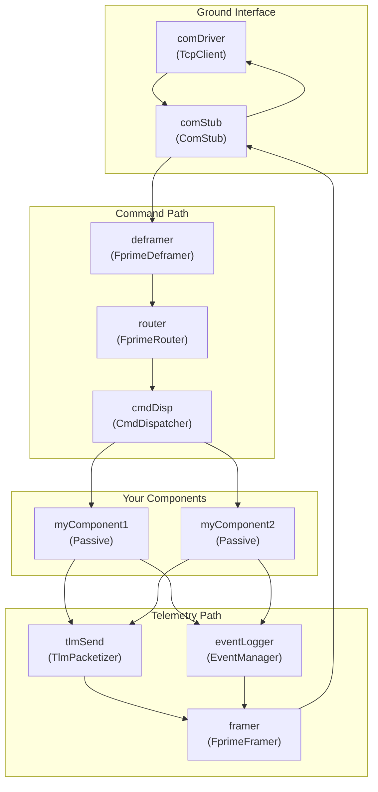
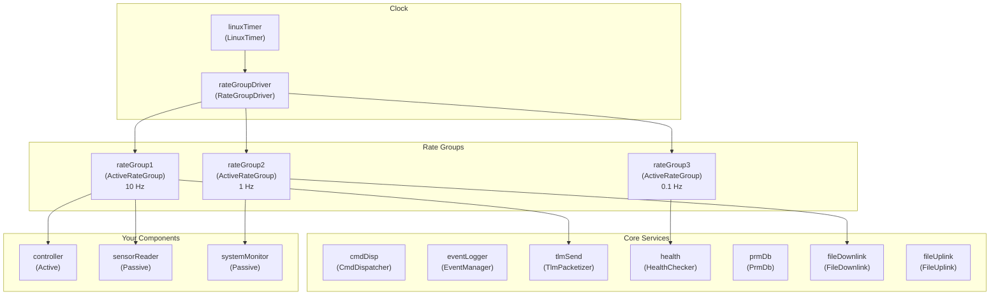

# Recommended Starter Topologies

When starting a new F' project, one of the most daunting tasks is designing the initial topology. This guide presents two canonical starter topologies that cover the most common use cases. Rather than building from scratch, you can start with one of these and modify it to suit your needs.

## Choosing a Starter Topology

| | Simple Topology | Flight-Like Topology |
|---|---|---|
| **Best for** | Prototyping, learning, ground-only testing | Mission development, flight-like testing |
| **Rate groups** | None | Yes (multiple rates) |
| **Health checking** | No | Yes |
| **Command/telemetry path** | Yes (minimal) | Yes (full) |
| **Component types** | Primarily passive | Mix of active and passive |
| **Complexity** | Low | Moderate |

## Simple Topology

The simple topology is designed for learning F' and rapid prototyping. It uses primarily passive components and has no rate groups, making it easier to understand and debug. Commands and telemetry still work, but periodic tasks must be triggered manually or by external events.

### Architecture



### Characteristics

- **No rate groups**: There is no periodic tick driving the system. Components respond to commands and external port invocations only.
- **Passive components**: User components are passive, executing on the caller's thread. This simplifies debugging since there is no concurrent execution within your components.
- **Minimal infrastructure**: Only the essential C&DH components (command dispatcher, event logger, telemetry database) are included.
- **Single communication path**: One driver handles both uplink and downlink.

### When to Use

- Learning F' for the first time
- Rapid prototyping of component behavior
- Unit and integration testing where rate-driven behavior is not needed
- Ground-software-only demonstrations

### FPP Skeleton

Below is a simplified FPP skeleton illustrating the structure. Adapt it based on the standard F' service components available in your project.

```fpp
module MyProject {

  # --- Instances ---

  # Communication
  instance comDriver: Drv.TcpClient base id 0x10000000
  instance comStub: Svc.ComStub base id 0x10001000

  # Command and Data Handling (from CdhCore subtopology or individual instances)
  instance cmdDisp: Svc.CmdDispatcher base id 0x10002000 \
    queue size 10 \
    stack size 64 * 1024 \
    priority 30

  instance eventLogger: Svc.EventManager base id 0x10003000
  instance tlmSend: Svc.TlmPacketizer base id 0x10004000
  instance posixTime: Svc.PosixTime base id 0x10005000
  instance textLogger: Svc.PassiveConsoleTextLogger base id 0x10006000

  # Your components
  instance myComponent: MyProject.MyComponent base id 0x10010000

  # --- Topology ---

  topology MyProject {
    instance comDriver
    instance comStub
    instance cmdDisp
    instance eventLogger
    instance tlmSend
    instance posixTime
    instance textLogger
    instance myComponent

    # Pattern connections (auto-wire standard services)
    command connections instance cmdDisp
    event connections instance eventLogger
    telemetry connections instance tlmSend
    text event connections instance textLogger
    time connections instance posixTime
  }
}
```

> [!TIP]
> The `command connections`, `event connections`, `telemetry connections`, `text event connections`, and `time connections` pattern graph specifiers automatically wire up the standard service ports for all component instances in the topology. You only need to add explicit connections for your custom ports.

## Flight-Like Topology

The flight-like topology includes rate groups, health checking, and a full command/telemetry path. It mirrors what a real mission deployment looks like and is the recommended starting point for any project that will eventually fly or run in a flight-like environment.

### Architecture



### Characteristics

- **Multiple rate groups**: Different components run at different rates (e.g., 10 Hz for control, 1 Hz for telemetry, 0.1 Hz for health).
- **Health checking**: The `Health` component periodically pings active components to detect hangs.
- **Mixed component types**: Active components for concurrent tasks (e.g., controllers), passive components for quick synchronous work (e.g., sensor reads).
- **Full C&DH**: Command dispatcher, event logger, telemetry database, parameter database, file uplink/downlink, and command sequencer.
- **Rate group priorities**: Faster rate groups are assigned higher thread priorities.

### When to Use

- Mission flight software development
- Flight-like testing and simulation
- Any project requiring periodic execution, health monitoring, or file management
- Starting point for a deployment that will be incrementally customized

### FPP Skeleton

```fpp
module MyProject {

  # --- Constants ---

  module Default {
    constant QUEUE_SIZE = 10
    constant STACK_SIZE = 64 * 1024
  }

  enum Ports_RateGroups {
    rateGroup1
    rateGroup2
    rateGroup3
  }

  # --- Active Component Instances ---

  instance rateGroup1Comp: Svc.ActiveRateGroup base id 0x10001000 \
    queue size Default.QUEUE_SIZE \
    stack size Default.STACK_SIZE \
    priority 43

  instance rateGroup2Comp: Svc.ActiveRateGroup base id 0x10002000 \
    queue size Default.QUEUE_SIZE \
    stack size Default.STACK_SIZE \
    priority 42

  instance rateGroup3Comp: Svc.ActiveRateGroup base id 0x10003000 \
    queue size Default.QUEUE_SIZE \
    stack size Default.STACK_SIZE \
    priority 41

  instance cmdSeq: Svc.CmdSequencer base id 0x10004000 \
    queue size Default.QUEUE_SIZE \
    stack size Default.STACK_SIZE \
    priority 20

  # --- Passive Component Instances ---

  instance rateGroupDriverComp: Svc.RateGroupDriver base id 0x10010000
  instance posixTime: Svc.PosixTime base id 0x10011000
  instance linuxTimer: Svc.LinuxTimer base id 0x10012000
  instance comDriver: Drv.TcpClient base id 0x10013000

  # Your components
  instance controller: MyProject.Controller base id 0x10020000 \
    queue size Default.QUEUE_SIZE \
    stack size Default.STACK_SIZE \
    priority 35

  instance sensorReader: MyProject.SensorReader base id 0x10021000

  # --- Topology ---

  topology MyProject {

    # Subtopologies for standard services
    # (use CdhCore, ComCcsds, FileHandling, etc. if available)

    instance rateGroup1Comp
    instance rateGroup2Comp
    instance rateGroup3Comp
    instance rateGroupDriverComp
    instance linuxTimer
    instance posixTime
    instance comDriver
    instance cmdSeq
    instance controller
    instance sensorReader

    # Pattern connections
    command connections instance cmdDisp
    event connections instance eventLogger
    telemetry connections instance tlmSend
    time connections instance posixTime
    health connections instance health

    # Rate group connections
    connections RateGroups {
      linuxTimer.CycleOut -> rateGroupDriverComp.CycleIn

      # 10 Hz rate group
      rateGroupDriverComp.CycleOut[Ports_RateGroups.rateGroup1] -> rateGroup1Comp.CycleIn
      rateGroup1Comp.RateGroupMemberOut[0] -> sensorReader.schedIn
      rateGroup1Comp.RateGroupMemberOut[1] -> controller.schedIn

      # 1 Hz rate group
      rateGroupDriverComp.CycleOut[Ports_RateGroups.rateGroup2] -> rateGroup2Comp.CycleIn
      rateGroup2Comp.RateGroupMemberOut[0] -> cmdSeq.schedIn

      # 0.1 Hz rate group
      rateGroupDriverComp.CycleOut[Ports_RateGroups.rateGroup3] -> rateGroup3Comp.CycleIn
    }
  }
}
```

> [!TIP]
> The [Ref application](https://github.com/nasa/fprime/tree/devel/Ref) is a complete, working example of a flight-like topology. Use it as a reference when building out your deployment.

### Rate Group Assignment Guidelines

When deciding which rate group a component belongs to, consider:

| Rate | Typical Components | Rationale |
|---|---|---|
| **Fast (e.g., 10 Hz)** | Control loops, sensor reads, telemetry send | Time-critical periodic work |
| **Medium (e.g., 1 Hz)** | Command sequencer, file downlink, system monitors | Regular but less time-sensitive tasks |
| **Slow (e.g., 0.1 Hz)** | Health checks, buffer cleanup, resource monitoring | Background maintenance |

> [!WARNING]
> Assign higher thread priorities to faster rate groups. If a slow rate group has higher priority than a fast one, it can starve the fast group of CPU time.

## Evolving Your Topology

Both starter topologies are meant as starting points. As your project grows:

1. **Add components** by declaring new instances and wiring their ports in the topology.
2. **Add rate groups** if you need additional execution rates.
3. **Introduce subtopologies** to organize related components into reusable groups (see [Subtopologies](subtopologies.md)).
4. **Enable health checking** by adding ping ports to active components and connecting them to the Health component.
5. **Add file management** with FileUplink and FileDownlink for on-board file operations.

## Further Reading

- [Execution Model Primer](../overview/execution-model.md) -- how code executes in F'
- [Rate Groups and Timeliness](rate-group.md) -- in-depth rate group guide
- [Constructing the F' Topology](../framework/building-topology.md) -- topology construction details
- [Subtopologies](subtopologies.md) -- organizing components into reusable groups
- [Ref Application](https://github.com/nasa/fprime/tree/devel/Ref) -- complete working example
