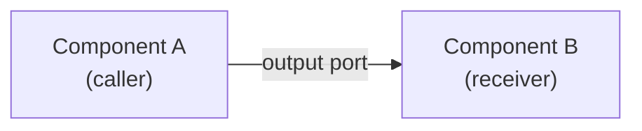
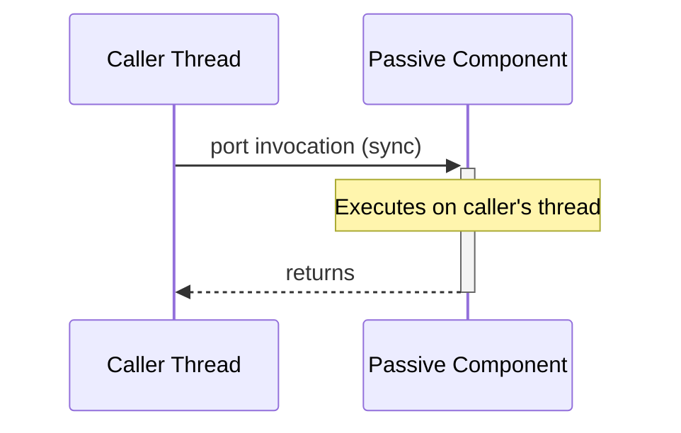
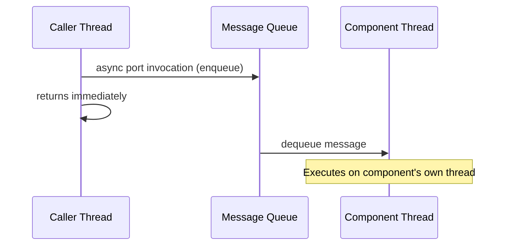
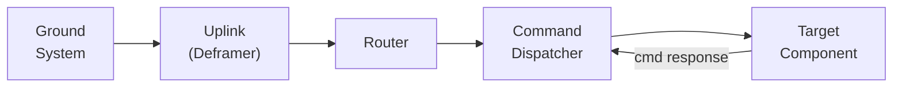
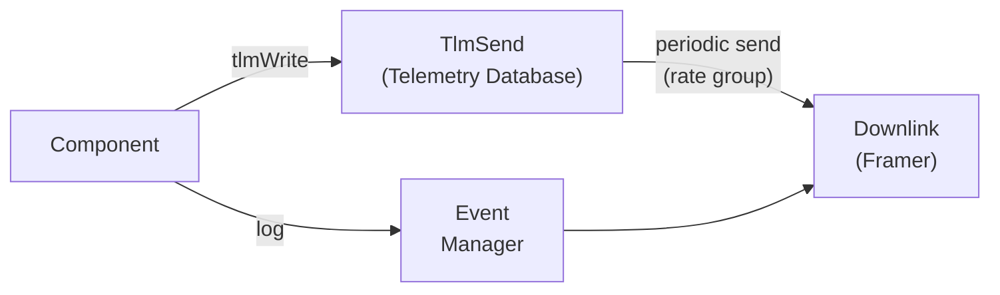
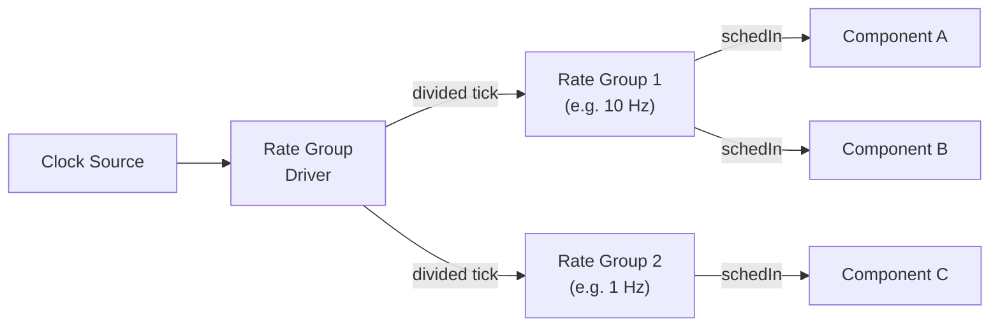

# Execution Model Primer

This page provides a concise overview of how code executes in an F' system. Understanding the execution model is essential for reasoning about thread safety, scheduling, and data flow in your deployment.

## How Components Communicate

F' components communicate exclusively through **ports**. A port invocation transfers control (and optionally data) from one component to another. The behavior of that transfer depends on the **port kind** and the **component type** on the receiving end.

There are two fundamental communication styles:

- **Synchronous**: The caller directly invokes the receiver's handler. Execution stays on the caller's thread. The caller blocks until the handler returns.
- **Asynchronous**: The caller serializes the arguments and places a message on the receiver's queue. The caller returns immediately. The receiver's thread later dequeues and dispatches the message.

## Component Types and Execution Context

The component type determines what execution resources are available:

| Component Type | Has Queue | Has Thread | Supports Async Ports |
|---|---|---|---|
| **Passive** | No | No | No |
| **Active** | Yes | Yes | Yes |
| **Queued** | Yes | No | Yes (but requires external dispatch) |

### Passive Components

Passive components have no thread and no queue. All port handlers execute on the **caller's thread**. This makes passive components lightweight but means they must not perform blocking or long-running operations, as doing so would block the caller.

### Active Components

Active components have their own thread and message queue. Asynchronous port invocations are placed on the queue and dispatched by the component's internal thread. Synchronous and guarded port invocations still execute on the caller's thread.

### Queued Components

Queued components have a message queue but no dedicated thread. Messages accumulate on the queue until an external synchronous port invocation triggers the component to drain and dispatch them. This is an advanced pattern and is rarely needed.

## The Command Path

When a ground operator sends a command, it flows through the system as follows:

1. **Uplink** receives raw bytes from the communication driver and deframes them.
2. The **Router** identifies the data as a command and forwards it to the Command Dispatcher.
3. The **Command Dispatcher** looks up the target component by opcode and invokes its command port.
4. The **target component** executes the command handler and sends back a completion status.

Whether the command handler runs on the dispatcher's thread or the component's own thread depends on the command kind (`sync`, `async`, or `guarded`) and the component type. See the [Thread-Context Matrix](thread-context.md) for details.

## Telemetry and Event Flow

Components emit telemetry and events through dedicated output ports connected to framework service components:

- **Telemetry channels** are written by components at any time. The `TlmSend` component periodically reads the latest values and sends them to the ground, typically driven by a [rate group](../design-patterns/rate-group.md).
- **Events** are emitted immediately by components and forwarded to the Event Manager for downlink.

## Rate Groups and Periodic Execution

Many embedded tasks must run at fixed rates (e.g., control loops at 10 Hz, telemetry collection at 1 Hz). F' provides this through the **rate group** pattern:

1. A **clock source** produces a base tick (e.g., from a hardware timer or OS sleep loop).
2. The **Rate Group Driver** divides this tick into sub-rates and sends them to individual rate groups.
3. Each **Rate Group** (active or passive) calls its attached components' `schedIn` ports in order.

Components attached to a rate group implement a `schedIn` handler that performs their periodic work. For a deeper dive, see [Rate Groups and Timeliness](../design-patterns/rate-group.md).

## Queues and Dispatch

Active and queued components use a message queue to buffer incoming asynchronous port invocations. Key points:

- Each async port invocation is serialized into a message and placed on the queue.
- The component's thread (for active components) dequeues messages in FIFO order and calls the appropriate handler.
- Queue depth is configured at instantiation time. If the queue is full, the system will assert (by default).
- **Synchronous and guarded ports bypass the queue entirely** and execute directly on the caller's thread, even on active components.

> [!NOTE]
> Guarded ports use a component-wide mutex to prevent concurrent execution across multiple guarded handlers on the same component. This protects shared state but introduces the risk of deadlock if components call each other's guarded ports in a cycle.

## Putting It All Together

A typical F' deployment combines all of these elements:

1. A **clock source** drives the **rate group driver**, which triggers **rate groups** at fixed intervals.
2. Rate groups invoke `schedIn` on attached components, causing periodic work.
3. Components communicate through **ports** -- synchronously for quick data retrieval, asynchronously for decoupled work.
4. **Commands** arrive from the ground through the uplink chain, are dispatched to components, and responses flow back.
5. **Events** and **telemetry** flow from components to the ground through the downlink chain.

The execution model ensures that each component's concurrency behavior is explicit and determined by its type and port kinds, making it possible to reason about thread safety and scheduling at the architectural level.

## Further Reading

- [Core Constructs: Ports, Components, and Topologies](03-port-comp-top.md) -- detailed port and component reference
- [Thread-Context Matrix](thread-context.md) -- quick-reference table for execution context
- [Rate Groups and Timeliness](../design-patterns/rate-group.md) -- in-depth rate group guide
- [Commands, Events, Channels, and Parameters](04-cmd-evt-chn-prm.md) -- data construct details
- [Ground Interface Architecture](../framework/ground-interface.md) -- uplink/downlink customization
